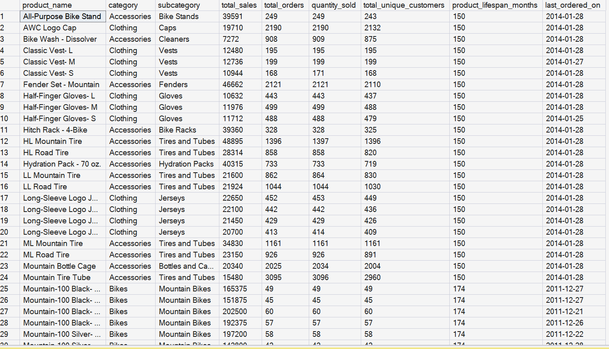

# Advanced SQL Data Analysis Project (SQL Server)

This project demonstrates advanced SQL analytics techniques used to analyze business performance, customer behavior, and product insights. Focuses on real-world business reporting scenarios using **views, case when, window functions, CTEs, subqueries, aggregations, and analytical KPIs**.

---

## Project Objectives

- Analyzed sales trends over time  
- Calculated cumulative metrics and moving averages  
- Measured product and business performance  
- Performed customer and product segmentation  
- Built reusable reporting views  
- Generated business-ready KPIs  

---

## Tools & Technologies

- SQL Server  
- T-SQL  
- SSMS (SQL Server Management Studio)  

---

## Database Schema Used

**Schema Name:** `gold`

### Fact Table
- `gold.fact_sales`

### Dimension Tables
- `gold.dim_customers`
- `gold.dim_products`

### Product Report Query Results Screen Shots are as Following:

-- base query's result:

-- final query's result:

